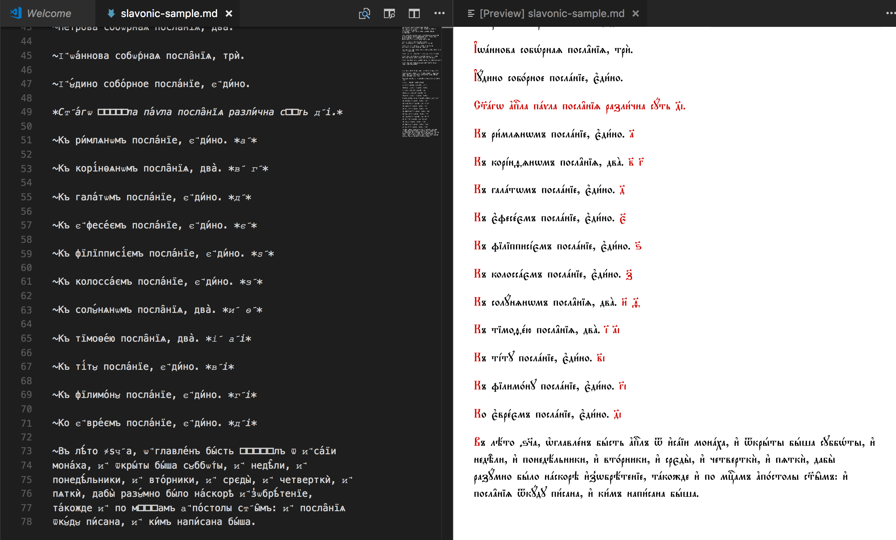

# Church Slavonic Markdown

Редактирование церковнославянских текстов в Visual Studio Code с использованием специального
диалекта разметки Markdown
([markdown-it-church-slavonic](https://github.com/slavonic/markdown-it-church-slavonic))

## Установка

1. Загружаем данный пакет в VSCode
2. Скачиваем и устанавливаем экранный шрифт ["Fira Slav"](https://sci.ponomar.net/fonts)

## Release Notes

### 0.0.1
Initial release
