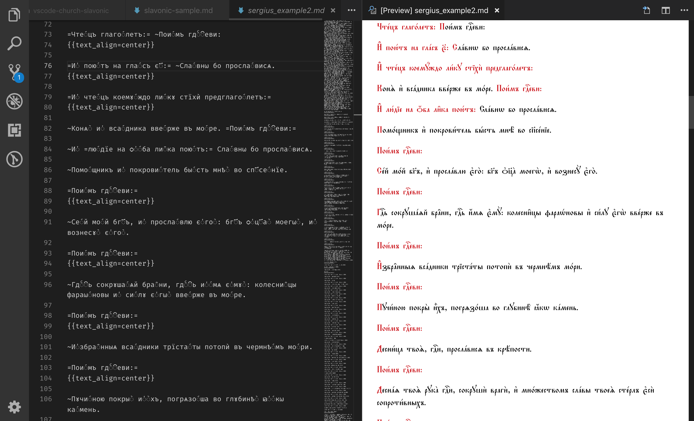

# Church Slavonic Markdown extensions

Allows authoring of Church Slavonic texts in Visual Studio Code using special flavor of
Markdown ([markdown-it-church-slavonic](https://github.com/slavonic/markdown-it-church-slavonic))

## Release Notes

### 1.0.0

Initial release
